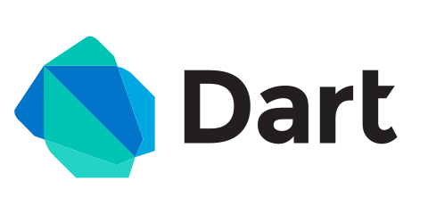

# Dragonfruit Flutter

Dragonfruit is a Multiplayer Augmented Reality game utilizing beacon IoT technology to showcase T-Mobile's 5G technologies, products, and services. 

## Getting Started

These instructions will get you a copy of the project up and running on your local machine for development and testing purposes. See deployment for notes on how to deploy the project on a live system.

### Installing

In order to use Flutter and compile down to both iOS and android, you have to install xcode and android studio. Head over to (https://flutter.dev/) and follow the instructions on installing.

## Deployment

To install on your iPhone or Android phone, use the following bash command to deploy it on your local environment
```
flutter run
```
For specific devices, first run
```
flutter devices

flutter run -d [mobile_device_id]
```

## Built With
* [Dart](https://www.dartlang.org/) - General-purpose programming language originally developed by Google

* [Flutter](https://flutter.dev/) - Open-source mobile application development framework created by Google

* [Unity](https://unity.com/) - Cross platform game engine specialized in AR/VR technologies


## Authors

* **Michael Lai**
* **David Dai**
* **Jerry Shen**
* **Difei Lu**
* **Angela Sun**
